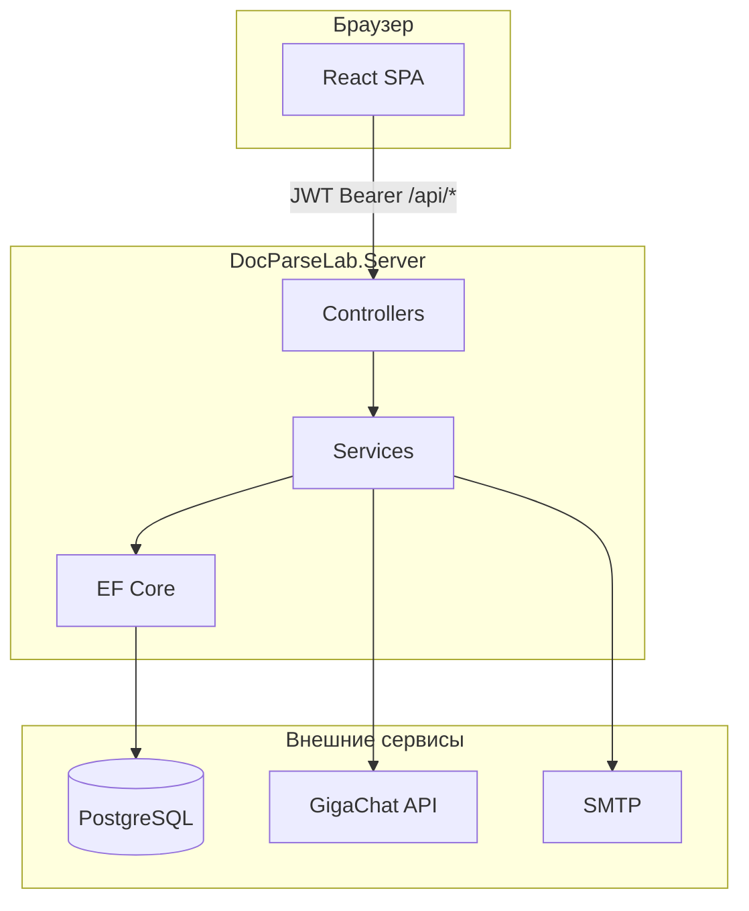
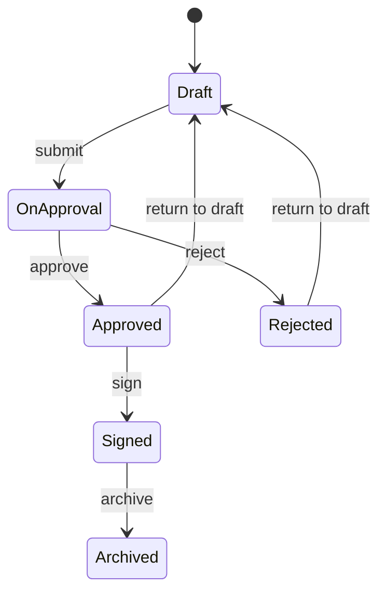

# DocParseLab

Веб-приложение для работы с офисными документами: загрузка **PDF** и **DOCX**, извлечение и редактирование текста, проверка орфографии и стиля через **GigaChat**, согласование, **внутренняя цифровая подпись**, реестр документов, версии, экспорт и отправка по email.

Подробный запуск и настройка окружения — в [RUN_INSTRUCTIONS.md](./RUN_INSTRUCTIONS.md).

---

## Содержание

1. [Назначение](#назначение)
2. [Возможности](#возможности)
3. [Технологии](#технологии)
4. [Архитектура](#архитектура)
5. [Роли пользователей](#роли-пользователей)
6. [Жизненный цикл документа](#жизненный-цикл-документа)
7. [Цифровая подпись](#цифровая-подпись)
8. [Структура репозитория](#структура-репозитория)
9. [Справочник API](#справочник-api)
10. [Конфигурация](#конфигурация)
11. [Быстрый старт](#быстрый-старт)
12. [Разработка](#разработка)
13. [Ограничения и перспективы](#ограничения-и-перспективы)

---

## Назначение

DocParseLab ориентирован на **внутренний документооборот** учебных и корпоративных сценариев:

- превратить PDF/DOCX в редактируемый текст;
- сохранить правки в PostgreSQL под учётной записью;
- пройти простой маршрут **согласования** и **подписания**;
- проверить целостность текста после подписи;
- вести **реестр** и **журнал действий** (audit).

Это **не полноценная СЭД** и **не замена УКЭП** (КриптоПро): юридически значимая квалифицированная подпись в текущей версии не реализована.

---

## Возможности

| Область | Описание |
|--------|----------|
| **Парсинг** | PDF (PdfPig), DOCX (Open XML SDK), OCR сканов (Tesseract) |
| **Редактирование** | Сохранение `EditedText`, история версий, восстановление версии |
| **AI (GigaChat)** | Краткое описание документа, переписывание фрагмента, орфография/стиль |
| **Орфография** | Hunspell + опционально нейросеть |
| **Офисный контур** | Реестр, карточка документа, тип, подразделение, ответственный, теги |
| **Согласование** | Отправка согласующему, утверждение, возврат на доработку |
| **Подпись** | SHA-256 хеш канонического текста, список подписей, проверка целостности |
| **Обмен** | Шаринг документа другому пользователю |
| **Экспорт** | DOCX, PDF (QuestPDF) |
| **Email** | Отправка экспорта через SMTP |
| **Enterprise** | Пакетная загрузка, audit log, чеклисты, извлечение сущностей, webhook |

---

## Технологии

| Слой | Стек |
|------|------|
| Backend | ASP.NET Core 8, EF Core, PostgreSQL, Swagger |
| Frontend | React 19, TypeScript, Vite 7 |
| PDF | UglyToad.PdfPig |
| DOCX | DocumentFormat.OpenXml |
| Экспорт PDF | QuestPDF |
| OCR | Tesseract |
| AI | GigaChat (HTTP API) |

Клиент при `npm run build` собирается в `DocParseLab.Server/wwwroot/` и раздаётся тем же Kestrel, что и API.

---

## Архитектура



**Основные контроллеры:**

| Контроллер | Префикс | Назначение |
|------------|---------|------------|
| `AuthController` | `/api/auth` | Вход, bootstrap, создание пользователей |
| `PdfController` | `/api/pdf` | Парсинг, документы, текст, экспорт, email, шаринг |
| `OfficeController` | `/api/office` | Реестр, workflow, метаданные, версии, подпись |
| `SpellcheckController` | `/api/spellcheck` | Проверка текста |
| `AiController` | `/api/ai` | AI-переписывание |
| `EnterpriseController` | `/api/enterprise` | Batch, audit, чеклисты, сущности |

Бизнес-логика вынесена в `DocParseLab.Server/Services/` (парсинг, экспорт, GigaChat, workflow, подписи, доступ).

---

## Роли пользователей

| Роль | Код | Кратко |
|------|-----|--------|
| Администратор | `Admin` | Полный доступ, создание пользователей, audit |
| Руководитель | `Manager` | Согласование, подпись в своём подразделении |
| Сотрудник | `Employee` | Работа со своими документами, отправка на согласование |
| Только просмотр | `Viewer` | Чтение доступных документов, без правок и подписи |

**Аутентификация:**

- Регистрация «с улицы» отключена.
- **Первый запуск:** `POST /api/auth/bootstrap` создаёт единственного администратора (пока в БД нет пользователей).
- **Дальше:** вход по email/паролю (`POST /api/auth/login`), JWT в заголовке `Authorization: Bearer <token>`.
- **Новые пользователи** создаёт только Admin (`POST /api/auth/users` или UI «Пользователи»).

---

## Жизненный цикл документа

Статусы (`WorkflowStatus`):

| Статус | Код | Смысл |
|--------|-----|--------|
| Черновик | `Draft` | Редактирование, отправка на согласование |
| На согласовании | `OnApproval` | Назначен согласующий |
| Согласован | `Approved` | Можно подписать |
| Подписан | `Signed` | Текст заблокирован, можно в архив |
| На доработке | `Rejected` | Возврат с комментарием |
| В архиве | `Archived` | Финальное хранение |



**Правила редактирования:** текст нельзя менять в статусах `OnApproval`, `Approved`, `Signed`, `Archived` (кроме прав владельца/ответственного в ранних статусах — см. `ParsedDocumentResponse.CanEdit` на сервере).

**Согласование:** владелец выбирает согласующего из списка пользователей; только назначенный `CurrentApproverUserId` может согласовать или вернуть.

**Архив:** только из статуса `Signed`.

---

## Цифровая подпись

Реализована **внутренняя электронная подпись** (не УКЭП):

1. Берётся **канонический текст** (`EditedText` или `FullText`, нормализованный).
2. Считается **SHA-256** (hex, нижний регистр).
3. В таблицу `DocumentSignatures` пишутся: хеш, подписант (snapshot email/ФИО/роли), время, комментарий, вид `internal`.
4. Статус документа → `Signed`.
5. **Проверка:** сравнение текущего хеша с хешем последней подписи (`GET .../signatures/verify`).

**Кто может подписать** (статус `Approved`):

- Admin;
- Manager того же подразделения, что и документ;
- владелец или ответственный;
- не Viewer.

В UI: панель «Цифровая подпись» в карточке документа.

Тип `external` в модели зарезервирован под будущую интеграцию с УКЭП.

---

## Структура репозитория

```
DocParseLab.sln
DocParseLab.Server/          # API, миграции EF, wwwroot (сборка фронта)
  Controllers/
  Services/
  Models/
  DTOs/
  Data/
  Migrations/
  Resources/Tessdata/        # языковые данные OCR (не в git — скачать отдельно)
docparselab.client/          # React SPA
  src/
    App.tsx                  # главный экран
    api/backend.ts           # /api/pdf, spellcheck, enterprise
    api/office.ts            # /api/office
    components/              # UI-панели
README.md                    # этот файл
RUN_INSTRUCTIONS.md          # установка и запуск
```

Артефакт `DocParseLab.Server/wwwroot/` после `npm run build` обычно не правят вручную.

---

## Справочник API

Все защищённые методы требуют JWT, если не указано иное.

### Auth (`/api/auth`)

| Метод | Путь | Доступ | Описание |
|-------|------|--------|----------|
| GET | `setup-status` | Аноним | `needsBootstrap: true`, если нет пользователей |
| POST | `bootstrap` | Аноним | Первый администратор |
| POST | `login` | Аноним | Вход, выдача JWT |
| POST | `users` | Admin | Создание пользователя |
| GET | `me` | JWT | Текущий профиль |

### Документы (`/api/pdf`)

| Метод | Путь | Описание |
|-------|------|----------|
| POST | `parse` | Загрузка PDF/DOCX, парсинг |
| GET | `my` | Список документов пользователя |
| GET | `{id}` | Карточка документа |
| PUT | `{id}/text` | Сохранение текста |
| DELETE | `{id}` | Удаление |
| GET | `{id}/export?format=docx\|pdf` | Экспорт файла |
| POST | `{id}/send-email` | Отправка на email |
| POST | `share` | Поделиться с пользователем |

### Офис (`/api/office`)

| Метод | Путь | Описание |
|-------|------|----------|
| GET | `registry` | Реестр с фильтрами |
| GET | `my-tasks` | Задачи на согласование |
| PATCH | `documents/{id}/metadata` | Карточка (тип, подразделение, теги…) |
| POST | `documents/{id}/submit` | На согласование |
| POST | `documents/{id}/approve` | Согласовать |
| POST | `documents/{id}/reject` | Вернуть на доработку |
| POST | `documents/{id}/return-to-draft` | В черновик |
| POST | `documents/{id}/sign` | Подписать |
| GET | `documents/{id}/signatures` | Список подписей |
| GET | `documents/{id}/signatures/verify` | Проверка целостности |
| POST | `documents/{id}/archive` | В архив (только Signed) |
| GET | `documents/{id}/versions` | Версии текста |
| GET | `documents/{id}/workflow-history` | История workflow |

### Прочее

| Префикс | Примеры |
|---------|---------|
| `/api/spellcheck` | `POST check` |
| `/api/ai` | `POST rewrite` |
| `/api/enterprise` | `parse-batch`, `audit`, `checklist`, `entities` |

Интерактивная документация: **http://localhost:5000/swagger** после запуска сервера.

Пакетная загрузка (`/api/enterprise/parse-batch`) допускает заголовок `X-Enterprise-Batch-Key` вместо JWT, если задан `Enterprise:BatchApiKey`.

---

## Конфигурация

Основной файл: `DocParseLab.Server/appsettings.json`.  
Для production скопируйте `appsettings.Production.json.example` → `appsettings.Production.json` (файл в `.gitignore`).

| Секция | Назначение |
|--------|------------|
| `ConnectionStrings:DefaultConnection` | PostgreSQL |
| `Jwt` | Ключ (≥32 символа), issuer, audience, срок токена |
| `GigaChat` | OAuth и API для AI |
| `Smtp` | Отправка документов на email |
| `Ocr` | Tesseract: языки, путь к tessdata |
| `Enterprise` | Webhook, batch key, audit, чеклисты |
| `Kestrel` | Порт (по умолчанию **5000**), лимит тела запроса |

Переменные окружения с двойным подчёркиванием переопределяют JSON, например: `ConnectionStrings__DefaultConnection`, `Jwt__Key`, `Smtp__Password`.

**Секреты не коммитьте** в репозиторий.

---

## Быстрый старт

```powershell
# 1. База PostgreSQL
# CREATE DATABASE pdf_parser_db;

# 2. Настроить appsettings.json (строка подключения)

# 3. Сборка и запуск
cd docparselab.client
npm install
npm run build
cd ..\DocParseLab.Server
dotnet run
```

Откройте **http://localhost:5000**. При первом входе создайте администратора (bootstrap), затем войдите и при необходимости добавьте пользователей в разделе администратора.

Подробности: [RUN_INSTRUCTIONS.md](./RUN_INSTRUCTIONS.md).

---

## Разработка

### Backend

```powershell
cd DocParseLab.Server
dotnet watch run
```

Миграции:

```powershell
dotnet ef migrations add ИмяМиграции
dotnet ef database update
```

Миграции также применяются при старте приложения (см. `ApplicationBuilderExtensions`).

### Frontend (hot reload)

```powershell
cd docparselab.client
npm run dev
```

Vite проксирует `/api` на URL из `ASPNETCORE_URLS` / `ASPNETCORE_HTTPS_PORT`.

### Сборка production

```powershell
cd docparselab.client && npm run build
cd ..\DocParseLab.Server && dotnet publish -c Release
```

---

## Ограничения и перспективы

- **УКЭП / КриптоПро** — не подключены; только внутренняя подпись по хешу.
- **Многошаговое согласование** — один согласующий за цикл.
- **Уведомления** — без email/push при смене статуса (можно добавить через webhook `Enterprise:WebhookUrl`).
- **Гостевой режим** — отключён; все операции с документами требуют входа.

Типичные направления развития: УКЭП, маршруты согласования, полнотекстовый поиск в реестре, уведомления, CRUD подразделений.

---

## Лицензия и контакты

Учебный/проектный репозиторий. Уточняйте условия использования у автора проекта.
